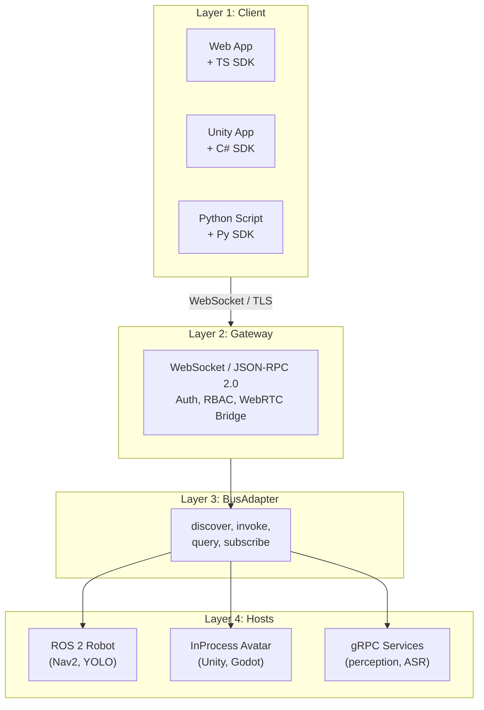

# OpenRoIS

[](https://www.omg.org/spec/RoIS/2.0/Beta2)
[](https://www.apache.org/licenses/LICENSE-2.0)
[](#status)
[](https://www.python.org/)
[](https://dotnet.microsoft.com/)
[](https://www.typescriptlang.org/)

> Open-source middleware for the [OMG RoIS Framework 2.0](https://www.omg.org/spec/RoIS/2.0/Beta2).
> Control **physical robots, virtual avatars, and digital agents** from one
> paradigm-neutral SDK. Apache-2.0. Alpha, pre-1.0, unstable API.

OpenRoIS lets operator applications control robots, avatars, and digital agents over
the internet through a single SDK. The host paradigm is hidden behind a gateway. A
scenario written once can drive a ROS 2 robot, a Unity avatar, or a distributed AI
service without code changes.

The primary demonstrated path is a Unity operator application controlling a ROS 2
robot over WebSocket. The same interfaces also drive in-process avatars and
distributed services.

---

## What is in this repository

This is the **core middleware repository**. It contains the interfaces, the engine,
the gateway, bus adapters, components, SDKs, and documentation.

```
openrois/
├── interfaces/              # Shared types: single source of truth
│   ├── python/              #   Pydantic models (hand-authored, source of truth)
│   ├── schema/              #   Canonical JSON Schema (generated, wire contract)
│   ├── csharp/              #   Generated C# types (OpenRoIS.Interfaces)
│   └── typescript/          #   Generated TypeScript types (@openrois/interfaces)
├── engine/                  # Bus-independent engine (Python): lifecycle, bind/execute
├── bus/                     # BusAdapter contract + reference adapters
│   ├── ros2/                #   ROS2BusAdapter (rclpy), primary robot adapter
│   ├── in_process/          #   InProcessBusAdapter (avatar reference)
│   └── grpc/                #   gRPCBusAdapter (distributed services)
├── gateway/                 # WebSocket server (Python), RoIS to BusAdapter, WebRTC bridge
├── components/              # Component nodes (Python), per-paradigm backends
├── sdk-js/                  # TypeScript/JS client SDK (web, secondary)
├── sdk-csharp/              # C# client SDK (Unity, primary)
├── sdk-py/                  # Python client SDK (scripting, secondary)
├── examples/                # Demo apps
├── integration/             # Cross-stack tests + launch configs
├── normative/               # OMG/JARA normative IDL, HPP, XML profiles (read-only)
└── docs/                    # Documentation
```

## The one critical rule

Types flow in one direction. **Never edit generated files by hand.**

```
Python (Pydantic) → JSON Schema → C# + TypeScript
```

- **Edit:** `interfaces/python/src/openrois/interfaces/*.py`
- **Don't edit:** `interfaces/schema/`, `interfaces/csharp/src/OpenRoIS.Interfaces/Generated/`, `interfaces/typescript/src/`

After editing Python models, run the full pipeline and all tests:

```bash
cd interfaces/python && python scripts/export_schema.py
cd ../typescript && npx tsx scripts/generate.ts && npm run typecheck && npm test
cd ../csharp && dotnet run --project scripts/Generator/Generator.csproj -- ../../schema && dotnet test
```

## Build and test

| Stack | Dir | Commands |
|-------|-----|----------|
| Python (source) | `interfaces/python` | `pip install -e ".[dev]"`, `ruff check src/`, `mypy src/`, `pytest -q` |
| TypeScript (generated) | `interfaces/typescript` | `npm install`, `npm run generate`, `npm run typecheck`, `npm test` |
| C# (generated) | `interfaces/csharp` | `dotnet build`, `dotnet test` |

CI (`.github/workflows/ci.yml`) runs all three on changes to `interfaces/**`.

## Architecture at a glance



The same four layers compose into physical robots, mixed fleets, single-process
avatars, and distributed services. Only the BusAdapter and host layout changes.

## Quick example

What it looks like to control a robot from a web application:

```ts
import { RoISEngine } from "@openrois/sdk";

const engine = await RoISEngine.connect("wss://gateway.example.com", {
  token: await getAccessToken(),
});

// Detect people (identical API whether the host is a robot or an avatar)
const pd = await engine.bind("PersonDetection");
pd.on("person_detected", (e) => console.log(`${e.number} people`));
await pd.start();

// Navigate
const nav = await engine.bind("Navigation");
await nav.execute({ target_positions: ["3.0,1.5,0.0"], time_limit: 30 });

// Stream live video
const video = await engine.bind("VideoStreaming");
const track = await video.connectStream();    // WebRTC track to <video> element
```

The same calls work from C# (Unity) or Python. The host paradigm is hidden behind
the gateway.

## Status

**Alpha, pre-1.0, unstable API.** The interface types (M0) are complete and stable.
The engine, gateway, bus adapters, components, and SDKs are under construction.

| Milestone | Theme | Status |
|-----------|-------|--------|
| M0 | Paradigm-Neutral Interfaces | DONE |
| M1 | Engine and In-Process Bus | TODO |
| M2 | Remote Gateway | TODO |
| M3 | ROS 2 Bus Adapter | TODO |
| M4 | Mock ROS 2 Robot Components | TODO |
| M5 | SDK and Robot MVP (v0.1.0) | TODO |
| M8 | Real Component and Mixed Paradigm | TODO |
| M9 | Auth and Bus Security | TODO |
| M10 | WebRTC Media | TODO |
| M11 | Full Component Library (v1.0) | TODO |

See the [roadmap](docs/roadmap.md) for milestone details and dependencies.

## Documentation

| Document | Description |
|----------|-------------|
| [White paper](docs/white-paper.md) | Architecture, design decisions, wire protocol, and deployment topologies for the R&D community |
| [Architecture](docs/architecture.md) | Engineering design document (how the system is designed) |
| [RoIS reference](docs/rois-reference.md) | OMG RoIS specification summary and reference (what the spec says) |
| [Roadmap](docs/roadmap.md) | Milestone roadmap (what is built and in what order) |

## Key conventions

- Python 3.12+, Pydantic v2, `from __future__ import annotations`, PEP 695 `type` statements, mypy strict, ruff line-length 100
- TypeScript ESM, strict typecheck, vitest
- C# `netstandard2.1` (Unity 6.3+), `sealed class`, `Nullable` enabled
- `normative/` is read-only (OMG/JARA copyright). Never modify.
- `interfaces/python/src/` must stay transport-neutral. No ROS, DDS, gRPC, or WebSocket imports.
- Don't change the `BusAdapter` protocol without reading `docs/architecture.md` section 7.5.

## Contributing

Contributions are welcome. The milestone roadmap defines clear, parallelizable work
items. Reference components are the natural entry point for new contributors.

Before contributing, read:

- [AGENTS.md](AGENTS.md) for coding conventions and the critical rule about generated files
- [CONTRIBUTING.md](CONTRIBUTING.md) for the PR process
- [docs/roadmap.md](docs/roadmap.md) for open work items

## License

```
Copyright 2026 Coarobo GK

Licensed under the Apache License, Version 2.0 (the "License");
you may not use this file except in compliance with the License.
You may obtain a copy of the License at

    http://www.apache.org/licenses/LICENSE-2.0

Unless required by applicable law or agreed to in writing, software
distributed under the License is distributed on an "AS IS" BASIS,
WITHOUT WARRANTIES OR CONDITIONS OF ANY KIND, either express or implied.
See the License for the specific language governing permissions and
limitations under the License.
```

The normative files in `normative/` retain their upstream copyright (JARA, ETRI, KAR,
OMG) and are not modified.

---

*OpenRoIS is an open-source middleware for the OMG RoIS Framework 2.0. Control
robots, avatars, and digital agents from one paradigm-neutral SDK. Apache-2.0.
Alpha, pre-1.0, unstable API.*
