# OpenRoIS: An Open-Source Middleware for the OMG RoIS Framework 2.0

> **White paper for the R&D community.** This document presents the architecture,
> design decisions, developer experience, wire protocol, and deployment topologies
> of OpenRoIS, an open-source middleware implementing the OMG Robotic Interaction
> Service (RoIS) Framework 2.0. It is written for robotics researchers, HRI engineers,
> and platform integrators evaluating or adopting the RoIS standard.
>
> **Companion documents:**
>
> - [architecture.md](architecture.md) — engineering design document (how the system
>   is designed, with implementation detail)
> - [rois-reference.md](rois-reference.md) — OMG RoIS specification summary and
>   reference (what the specification says)
> - [roadmap.md](roadmap.md) — milestone roadmap (what is built and in what order)
>
> **Status:** Alpha, pre-1.0, unstable API. Only the interfaces layer (M0) is
> complete. The engine, gateway, bus adapters, components, and SDKs are planned or
> under construction. The OMG RoIS Framework is at version 2.0-beta2 and may change.

---

## Table of Contents

1. [Introduction](#1-introduction)
2. [Background: The RoIS Framework](#2-background-the-rois-framework)
3. [Architectural Decisions](#3-architectural-decisions)
4. [Layered Architecture](#4-layered-architecture)
5. [The BusAdapter Contract](#5-the-busadapter-contract)
6. [Interface Type Pipeline](#6-interface-type-pipeline)
7. [Developer Experience: Three SDKs](#7-developer-experience-three-sdks)
8. [The Wire Protocol: JSON-RPC 2.0](#8-the-wire-protocol-json-rpc-20)
9. [Deployment Topologies](#9-deployment-topologies)
10. [Transport Strategy](#10-transport-strategy)
11. [Control Plane vs. Data Plane](#11-control-plane-vs-data-plane)
12. [Security Architecture](#12-security-architecture)
13. [Component Library](#13-component-library)
14. [Roadmap and Maturity](#14-roadmap-and-maturity)
15. [Related Work and Positioning](#15-related-work-and-positioning)
16. [Conclusion](#16-conclusion)

---

## 1. Introduction

Controlling robots from software applications has long suffered from a
fragmentation problem. Each robot platform exposes its own hardware-specific API
(`find face`, `wheel control`, `read battery`). Any hardware change forces an
application rewrite, which kills reusability and slows research transfer from
simulation to deployment.

The OMG Robotic Interaction Service (RoIS) Framework addresses this by defining a
**platform-independent model** for human-robot interaction (HRI) at the **symbolic
level**. Instead of raw sensor data and motor commands, applications exchange
structured messages: "a person was detected", "approach the person", "say this
message". All hardware-specific concerns are hidden behind standardized interfaces.

A specification alone does not drive adoption. Researchers and engineers need a
usable implementation: a clean SDK, reference adapters for real robotics ecosystems,
a gateway that bridges the spec's interfaces to the network, and a component library
that demonstrates the full stack working end to end.

**OpenRoIS** is that implementation. It is an open-source, Apache-2.0 licensed
middleware that implements the OMG RoIS Framework 2.0 and lets operator applications
control **physical robots, virtual avatars, and digital agents** over the internet
through a single, paradigm-neutral SDK.

### 1.1 Contributions

This white paper describes the following contributions:

1. A **paradigm-neutral architecture** for RoIS 2.0 that decouples the engine,
   gateway, and client SDK from any specific middleware through a five-method
   `BusAdapter` contract (section 5).
2. A **single-source-of-truth type pipeline** that authors interfaces as Python
   Pydantic models and generates C# and TypeScript types from a canonical JSON
   Schema, keeping three language stacks consistent without manual synchronization
   (section 6).
3. A **JSON-RPC 2.0 wire protocol** mapping of the five RoIS interfaces over
   WebSocket, with full message examples for every interface operation (section 8).
4. Three **client SDKs** (C# for Unity, TypeScript for web, Python for scripting)
   that expose identical behavior regardless of the host paradigm behind the gateway
   (section 7).
5. Four **deployment topologies** that compose the same layers into physical robots,
   mixed fleets, single-process avatars, and distributed services (section 9).
6. A **transport strategy** that selects the right transport at each boundary rather
   than forcing one everywhere (section 10).

### 1.2 Target audience

This document is written for:

- **Robotics researchers** evaluating RoIS 2.0 as a standard for HRI scenarios.
- **HRI engineers** building operator applications for robots or avatars.
- **Platform integrators** connecting existing robotics stacks (ROS 2, Unity,
  gRPC services) to a standard interface.
- **Standards participants** interested in how a beta specification translates to a
  working implementation.

---

## 2. Background: The RoIS Framework

### 2.1 What RoIS is

RoIS defines a **platform-independent model (PIM)** of a framework that handles the
messages and data exchanged between HRI service components and service
applications. The central idea: a service application interacts with robots on the
**symbolic level** rather than the **physical level**. Messages carry only symbolic
data. Raw sensor data (image buffers, audio streams) is never carried in RoIS
messages. Symbolic results can be fed directly into conditional logic in a robot
scenario.

RoIS is developed by JARA, ETRI, KAR, and the Object Management Group (OMG). The
current version is **2.0-beta2** (OMG document dtc/2025-09-22). The normative
machine-readable files include IDL/HPP headers, component XML profiles, an
XML-Profiles schema, and an OWL ontology.

### 2.2 Framework structure

The framework is organized in three conceptual layers:

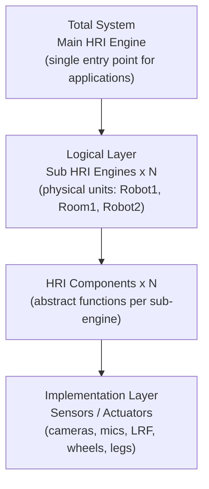

Key rules from the specification:

- A system may consist of **multiple physical units**. Each is a sub HRI Engine. The
  whole system is the main HRI Engine that contains them.
- The application talks to **only the main HRI Engine**. Selection and switching
  between sub-engines and components happens engine-side and is invisible to the
  application.
- One physical unit can host more than one function, so physical units and
  functional units are defined separately (no one-to-one mapping).

### 2.3 The five interfaces

RoIS exposes one System interface plus three information-exchange interfaces, plus a
Streaming interface layered on the others.

| Interface | Direction and style | Key operations |
|-----------|---------------------|----------------|
| System | Connection management, synchronous | `connect`, `disconnect`, `get_profile`, `get_error_detail` |
| Command | App to Engine, async execution | `search`, `bind`, `bind_any`, `release`, `get_parameter`, `set_parameter`, `execute`, `get_command_result` |
| Query | App to Engine, synchronous | `query` |
| Event | Engine to App, async notifications | `subscribe`, `unsubscribe`, `get_event_detail`, `notify_event` |
| Streaming | Two-way stream control | `connect_stream`, `disconnect_stream`, `suspend_stream`, `resume_stream`, `query_stream_status`, `notify_stream_status` |

### 2.4 Command execution model

Because a component may be shared by multiple applications, command usage follows a
three-step reservation pattern:

1. **Bind**: `search(condition)` returns candidate `component_ref`s, then
   `bind(component_ref)` reserves one. Optionally `get_parameter` / `set_parameter`.
2. **Execute**: `execute(command_unit_list)` sends a command message and returns a
   `command_id` immediately. The operation runs asynchronously. Completion arrives
   via `completed(command_id, status)`. Detailed results via
   `get_command_result(command_id)`.
3. **Release**: `release(component_ref)` frees the component.

The `command_unit_list` can express **sequential and parallel** command operations
through `CommandUnitSequence` containing `CommandMessage` and `ConcurrentCommands`
entries.

### 2.5 What RoIS does not define

RoIS defines messages, not transport. The C++ and CORBA platform-specific models
(PSMs) define method signatures only. RoIS messages can run over CORBA, RTC,
ROS/ROS 2 (DDS), WebSocket, or any transport. Interoperability is scoped to within a
single transport. RoIS also does not define media codecs. Streaming media formats are
out of scope. This separation of message from transport is central to the OpenRoIS
architecture.

---

## 3. Architectural Decisions

OpenRoIS is shaped by a set of deliberate architectural decisions. Each one is
designed to keep the core paradigm-neutral, the SDK simple, and the system
extensible without rewrites.

### 3.1 Paradigm-neutral core

The engine, gateway, and client SDK never assume hardware, a world model, or any
specific middleware. A single `BusAdapter` abstraction decouples the core from ROS 2,
in-process runtimes, gRPC services, or any future paradigm. Adding a new paradigm is
an additive adapter, never a rewrite.

This decision is enforced structurally, not by convention. The engine has zero
references to ROS, DDS, gRPC, or any game engine. A grep for transport-specific
symbols in the engine source returns nothing. The same contract test suite runs
against every adapter, catching paradigm leakage.

### 3.2 Spec-first, symbolic data only

Every interface traces back to the normative IDL in `normative/machine-readable/`.
Messages carry only symbolic data ("person detected, count: 2"), never raw sensor
buffers. This keeps the control plane lightweight and lets scenario logic use simple
conditional branching on structured results.

### 3.3 Single source of truth for types

Types flow in one direction:

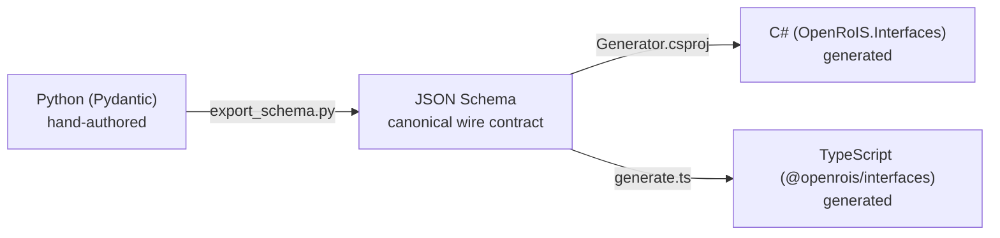

Python Pydantic models are the source of truth. JSON Schema is the canonical wire
format. C# and TypeScript types are **generated, never hand-written**, so all three
language stacks stay consistent. A schema-drift test in CI verifies that committed
schemas match Pydantic output. This eliminates an entire class of bugs: type
mismatches between the SDK and the gateway.

### 3.4 Transport-appropriate, not transport-uniform

OpenRoIS does not invent a new wire protocol and does not force one transport
everywhere. Each boundary uses the transport that fits best: WebSocket for remote
control, ROS 2/DDS for the robot bus, in-process calls for avatars, gRPC for
distributed services, WebRTC for media. This respects the spec's separation of
message from transport while choosing concrete, proven technologies for each
boundary.

### 3.5 Vertical slices over horizontal layers

Each milestone delivers a working end-to-end path, not an isolated layer. M0
through M5 culminate in a usable robot demo (the MVP). The in-process adapter is
built first because it is the simplest. This ordering is a guard against DDS
assumptions leaking into the core: if the simplest adapter works, and the engine
depends only on the `BusAdapter` contract, then adding DDS later cannot retroactively
introduce coupling.

### 3.6 The SDK is the product

Adoption is driven by how easy it is to write a scenario. The SDK is identical
whether the host is a physical robot, a virtual avatar, or a distributed service.
The host paradigm is hidden behind the gateway. A researcher who writes a scenario
against the SDK does not need to know whether the target is a ROS 2 robot or a
Unity avatar. Only the gateway configuration changes.

---

## 4. Layered Architecture

OpenRoIS is organized in four layers. The client SDK and gateway are constant across
all deployments. Only the BusAdapter and host layout change.

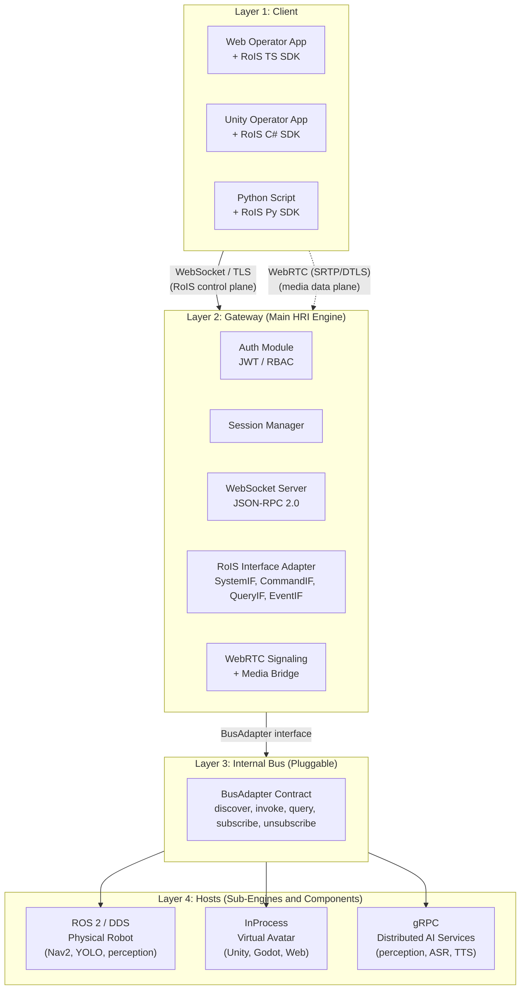

The spec's "main HRI Engine" maps to the **Gateway** (Layer 2). Each "sub HRI Engine"
maps to a **per-host node** (Layer 4): a robot node, an avatar process, or a service.
"HRI Components" map to whatever the chosen BusAdapter addresses: in-process objects,
gRPC services, or ROS 2 component nodes. The client only ever talks to the gateway.
The host topology and paradigm are hidden, exactly as the specification requires.

### 4.1 Mapping RoIS concepts to OpenRoIS layers

| RoIS concept | OpenRoIS implementation | Layer |
|-------------|------------------------|-------|
| Main HRI Engine | Gateway (Python, asyncio) | 2 |
| Sub HRI Engine | Per-host node (robot node, avatar process, service) | 4 |
| HRI Component | In-process object, gRPC service, or ROS 2 node | 4 |
| Service Application | Client SDK (C#, TypeScript, or Python) | 1 |
| RoIS interfaces (SystemIF, CommandIF, QueryIF, EventIF, Streaming) | JSON-RPC 2.0 methods over WebSocket | 1 to 2 |
| Transport (unspecified by RoIS) | BusAdapter contract + concrete adapters | 3 |

### 4.2 Gateway responsibilities

The gateway is the only internet-facing process and the single enforcement point for
security. It:

- Terminates the remote transport (WebSocket/TLS) and authenticates every connection
  before any RoIS message is processed.
- Translates JSON-RPC RoIS calls to bus adapter operations (service/action/topic for
  ROS 2, method calls for in-process, gRPC for distributed services).
- Aggregates profiles from all authorized sub-engines into one `HRI_Engine_Profile`
  returned by `get_profile()`.
- Filters `search()` and `query()` results and guards `bind()` and `execute()` per
  the caller's authorization scope.
- Relays WebRTC signaling (SDP/ICE) over the same WebSocket connection and bridges
  media through an SFU when needed.

---

## 5. The BusAdapter Contract

The `BusAdapter` is the single abstraction that decouples the engine from any
paradigm. The engine, gateway, and SDK depend only on this five-method contract. They
never reference ROS, DDS, gRPC, or a game engine.

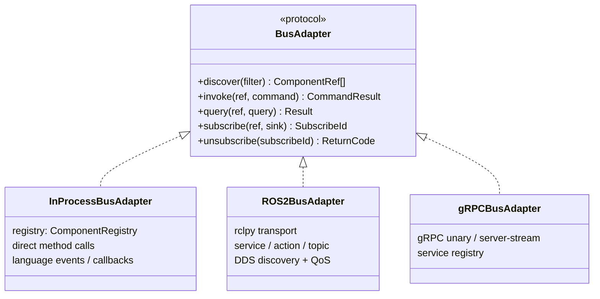

### 5.1 Method semantics

| Method | Purpose | ROS 2 mapping | InProcess mapping | gRPC mapping |
|--------|---------|---------------|-------------------|--------------|
| `discover` | Find components by condition | DDS discovery | registry lookup | service registry |
| `invoke` | Execute a command (start, stop, execute, set_parameter) | ROS 2 action or service | direct method call | gRPC unary |
| `query` | Synchronous read (component_status, get_parameter) | ROS 2 service | direct method call | gRPC unary |
| `subscribe` | Async event push (notify_event, notify_stream_status) | ROS 2 topic subscription | callback / language event | gRPC server-stream |
| `unsubscribe` | Cancel an event subscription | ROS 2 topic unsubscribe | remove callback | cancel gRPC stream |

### 5.2 RoIS operation to BusAdapter method mapping

The RoIS interface operations map to BusAdapter methods as follows:

- Synchronous operations (`query`, `get_parameter`, `component_status`) map to
  `query`.
- Command and long-running operations (`execute`, `start`, `set_parameter`) map to
  `invoke`.
- Async push operations (`notify_event`, `notify_stream_status`) map to `subscribe`
  plus an event sink.

### 5.3 Why five methods

The contract is deliberately kept to five methods. Adding transport-specific knobs
(QoS policies, deadlines, reliability) to the contract would leak paradigm
assumptions into the engine. Instead, QoS, deadlines, and reliability belong to
whichever adapter needs them. Only the ROS 2 adapter needs DDS QoS. The in-process
adapter does not. Keeping the contract minimal means the engine can drive a ROS 2
robot fleet, an in-process avatar, or a distributed set of gRPC services with the
same code path.

Because the engine sees only `BusAdapter`, accidental coupling (for example, baking
DDS QoS semantics into the engine) is structurally prevented. The same contract test
suite runs against every adapter, catching paradigm leakage.

---

## 6. Interface Type Pipeline

The RoIS interfaces are authored once in Python and generated into three language
stacks. This ensures type consistency without manual synchronization.

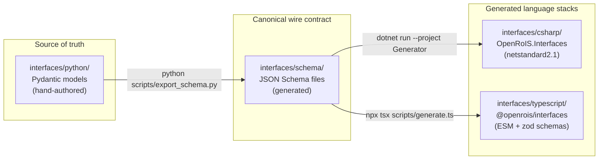

### 6.1 Pipeline steps

1. **Author** Pydantic models in `interfaces/python/src/openrois/interfaces/`.
2. **Export** to JSON Schema: `cd python && python scripts/export_schema.py`.
3. **Generate** C#: `cd csharp/scripts/Generator && dotnet run -- ../../schema`.
4. **Generate** TypeScript: `cd typescript && npx tsx scripts/generate.ts`.

The pipeline runs in CI on every change to `interfaces/**`. A schema-drift test
verifies that committed JSON Schema files match the current Pydantic output. C# and
TypeScript types are never hand-written.

### 6.2 Packages

| Package | Language | Registry | Status |
|---------|----------|----------|--------|
| `openrois-interfaces` | Python 3.12+ | PyPI | Source of truth (M0 complete) |
| `OpenRoIS.Interfaces` | C# (netstandard2.1) | NuGet / UPM | Generated (M0 complete) |
| `@openrois/interfaces` | TypeScript (ESM) | npm | Generated (M0 complete) |

### 6.3 Typed message pattern

Instead of using the generic `Result(value=str)` for all event payloads, OpenRoIS
defines typed Pydantic models per component. For example, the PersonDetection
component's `person_detected` event is modeled as:

```python
class PersonDetectedEvent(BaseModel):
    timestamp: DateTime = Field(description="Time when measured")
    number: Integer = Field(description="Number of detected persons")
```

This provides compile-time safety in all three language stacks. The generic `Result`
type remains available as a JSON fallback for genuinely dynamic payloads, but the
preferred path is typed messages per component.

### 6.4 Cross-validation

Types are cross-checked against the normative XML profiles
(`PersonDetection.xml`, `Navigation.xml`, `SystemInformation.xml`) and validated
against `XML-Profiles.xsd`. This ensures the generated types agree with the
specification's machine-readable artifacts, not just with each other.

---

## 7. Developer Experience: Three SDKs

OpenRoIS ships three client SDKs, each targeting a different developer audience.
All three expose the same five RoIS interfaces (System, Command, Query, Event,
Streaming) and produce identical behavior regardless of the host paradigm behind the
gateway.

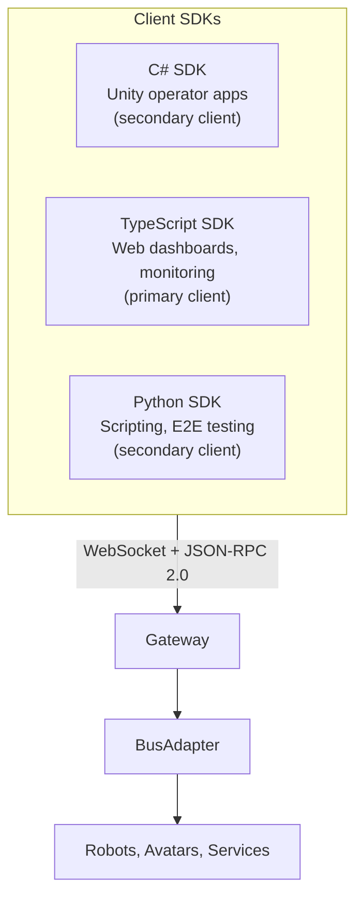

### 7.1 C# SDK for Unity (secondary client)

The C# SDK (`OpenRoIS.Sdk` / `org.openrois.sdk`) is a secondary client SDK, targeting
Unity operator applications. It connects to the gateway over WebSocket using
JSON-RPC 2.0, with async connect, auto-reconnect, token handling, heartbeat, and
typed errors. Component proxies provide typed access to each RoIS component with
event handlers.

```csharp
var engine = await RoISEngine.ConnectAsync(
    "wss://gateway.example.com",
    new ConnectOptions { Token = token });

var pd = await engine.BindAsync("PersonDetection");
var nav = await engine.BindAsync("Navigation");

pd.On("person_detected", e => UpdateCount(e.Number));
await pd.StartAsync();

await nav.ExecuteAsync(new TargetPosition(x: 3.0f, y: 1.5f, theta: 0f));
```

Key characteristics:

- Packaged for Unity via UPM (`org.openrois.sdk`) and NuGet (`OpenRoIS.Sdk`).
- Targets `netstandard2.1` for Unity 6.3+ (Mono) through Unity 6.8 (CoreCLR).
- SDK callbacks are marshaled to the Unity main thread (documented pattern, tested
  in Play Mode).
- Typed component proxies: `engine.BindAsync("PersonDetection")` returns a typed
  proxy with `.On(event)` handlers.

### 7.2 TypeScript SDK for web (primary client)

The TypeScript SDK (`@openrois/sdk`) is the primary client SDK for web applications:
operator dashboards, monitoring tools, configuration UIs, and automated testing. It
runs in both browsers and Node.js.

```ts
import { RoISEngine } from "@openrois/sdk";

const engine = await RoISEngine.connect("wss://gateway.example.com", {
  token: await getAccessToken(),
});

const pd = await engine.bind("PersonDetection");
pd.on("person_detected", (e) => console.log(`${e.number} people`));
await pd.start();

const nav = await engine.bind("Navigation");
await nav.execute({ target_positions: ["3.0,1.5,0.0"], time_limit: 30 });

const video = await engine.bind("VideoStreaming");
const track = await video.connectStream();    // WebRTC track to video element
```

Key characteristics:

- TypeScript strict mode, no `any`, no implicit returns.
- Runtime validation via zod schemas imported from `@openrois/interfaces`.
- Dual ESM/CJS output (tsup), browser and Node.js compatible.
- Auto-reconnect with exponential backoff, heartbeat, typed error hierarchy.
- Ships with a mock gateway (`integration/mock-gateway/`) for testing all SDKs.

### 7.3 Python SDK for scripting (secondary client)

The Python SDK (`openrois-sdk`) mirrors the core API for scripting, automated
testing of the gateway and ROS 2 adapter, and E2E validation. It reuses the same
protocol surface defined by the other SDKs.

```python
import asyncio
from openrois.sdk import RoISEngine

async def main():
    engine = await RoISEngine.connect(
        "wss://gateway.example.com",
        token=get_access_token(),
    )

    pd = await engine.bind("PersonDetection")
    pd.on("person_detected", lambda e: print(f"{e.number} people"))
    await pd.start()

    nav = await engine.bind("Navigation")
    await nav.execute(target_positions=["3.0,1.5,0.0"], time_limit=30)

asyncio.run(main())
```

Key characteristics:

- Built on the same Pydantic types that are the source of truth for the entire
  project, so there is no type bridge needed.
- Used for E2E testing of the gateway and ROS 2 adapter.
- Async-first (asyncio), mirroring the engine and gateway runtime.

### 7.4 SDK interface mapping

All three SDKs mirror the five RoIS interfaces defined in the normative IDL:

| RoIS Interface | SDK client | Key operations |
|----------------|-----------|----------------|
| SystemIF | `SystemClient` | `connect()`, `disconnect()`, `getProfile()`, `getErrorDetail()` |
| CommandIF | `CommandClient` | `search()`, `bind()`, `bindAny()`, `release()`, `getParameter()`, `setParameter()`, `execute()`, `getCommandResult()` |
| QueryIF | `QueryClient` | `query()` |
| EventIF | `EventClient` | `subscribe()`, `unsubscribe()`, `getEventDetail()`, callback: `onNotifyEvent` |
| Streaming | `StreamClient` | `connectStream()`, `disconnectStream()`, `suspendStream()`, `resumeStream()`, `queryStreamStatus()` |

The callback surface comes directly from `ServiceApplicationBase` in the
specification: `notify_error`, `completed`, and `notify_event`.

### 7.5 Paradigm transparency

The same SDK calls drive a real ROS 2 robot and an in-process avatar. Only the host
behind the gateway changes. This is the core value proposition for researchers: a
scenario written once can be tested against a mock robot, deployed against a real
ROS 2 robot, and reused against a virtual avatar without code changes.

---

## 8. The Wire Protocol: JSON-RPC 2.0

The remote client talks to the gateway over **WebSocket** using **JSON-RPC 2.0** as
the message envelope. Every RoIS interface operation maps to a JSON-RPC method in a
namespaced hierarchy. The gateway processes requests and sends responses, and also
pushes asynchronous notifications (events, command completions, errors) to the client
as JSON-RPC notifications (messages with no `id` field).

### 8.1 Method namespaces

```
rois.system.*     SystemIF:    connect, disconnect, get_profile, get_error_detail
rois.command.*    CommandIF:   search, bind, bind_any, release, get_parameter, set_parameter, execute, get_command_result
rois.query.*      QueryIF:     query
rois.event.*      EventIF:     subscribe, unsubscribe, get_event_detail
rois.stream.*     Streaming:   connect_stream, disconnect_stream, suspend_stream, resume_stream, query_stream_status
```

Server-to-client push (no `id` field, JSON-RPC notifications):

```
rois.event.notify          notify_event(event_id, event_type, subscribe_id, expire, results)
rois.system.notify_error   notify_error(error_id, error_type)
rois.command.completed     completed(command_id, status)
rois.stream.notify_status  notify_stream_status(stream_id, status)
```

### 8.2 Full method catalog

#### System interface (`rois.system.*`)

| Method | Params | Response |
|--------|--------|----------|
| `rois.system.connect` | `{}` | `{return_code: "OK"}` |
| `rois.system.disconnect` | `{}` | `{return_code: "OK"}` |
| `rois.system.get_profile` | `{condition: string}` | `{return_code, profile: string}` |
| `rois.system.get_error_detail` | `{error_id: string}` | `{return_code, results: Result[]}` |

#### Command interface (`rois.command.*`)

| Method | Params | Response |
|--------|--------|----------|
| `rois.command.search` | `{condition: string}` | `{return_code, component_ref_list: string[]}` |
| `rois.command.bind` | `{component_ref: string}` | `{return_code}` |
| `rois.command.bind_any` | `{condition: string}` | `{return_code, component_ref: string}` |
| `rois.command.release` | `{component_ref: string}` | `{return_code}` |
| `rois.command.get_parameter` | `{component_ref: string}` | `{return_code, parameters: Parameter[]}` |
| `rois.command.set_parameter` | `{component_ref, parameters: Parameter[]}` | `{return_code, command_id: string}` |
| `rois.command.execute` | `{command_unit_list: CommandUnitSequence}` | `{return_code, command_id: string}` |
| `rois.command.get_command_result` | `{command_id: string}` | `{return_code, results: Result[]}` |

#### Query interface (`rois.query.*`)

| Method | Params | Response |
|--------|--------|----------|
| `rois.query.query` | `{component_ref, query_type: string, condition: string}` | `{return_code, results: Result[]}` |

#### Event interface (`rois.event.*`)

| Method | Params | Response |
|--------|--------|----------|
| `rois.event.subscribe` | `{component_ref, event_type: string, condition: string}` | `{return_code, subscribe_id: string}` |
| `rois.event.unsubscribe` | `{subscribe_id: string}` | `{return_code}` |
| `rois.event.get_event_detail` | `{event_id: string}` | `{return_code, results: Result[]}` |

#### Streaming interface (`rois.stream.*`)

| Method | Params | Response |
|--------|--------|----------|
| `rois.stream.connect_stream` | `{component_ref, parameters: Parameter[]}` | `{return_code, stream_id: string}` |
| `rois.stream.disconnect_stream` | `{stream_id: string}` | `{return_code}` |
| `rois.stream.suspend_stream` | `{stream_id: string}` | `{return_code}` |
| `rois.stream.resume_stream` | `{stream_id: string}` | `{return_code}` |
| `rois.stream.query_stream_status` | `{stream_id: string}` | `{return_code, status: StreamStatus}` |

### 8.3 Core data types on the wire

All payloads use the types generated from the canonical JSON Schema. The key
structures:

**Result** (returned by `query`, `get_command_result`, `get_event_detail`):

```json
{
  "name": "number",
  "data_type_ref": "int",
  "value": "2"
}
```

**Parameter** (sent by `set_parameter`, returned by `get_parameter`):

```json
{
  "name": "target_positions",
  "data_type_ref": "string[]",
  "value": "[\"3.0,1.5,0.0\"]"
}
```

**CommandUnit** (element of a `CommandUnitSequence`):

```json
{
  "component_ref": "robot-a1/Navigation",
  "command_type": "execute",
  "command_id": "cmd-001",
  "arguments": [
    {"name": "target_positions", "data_type_ref": "string[]", "value": "[\"3.0,1.5,0.0\"]"},
    {"name": "time_limit", "data_type_ref": "int", "value": "30"}
  ]
}
```

**ReturnCode** values: `OK`, `ERROR`, `BAD_PARAMETER`, `UNSUPPORTED`,
`OUT_OF_RESOURCES`, `TIMEOUT`.

**ComponentStatus** values: `UNINITIALIZED`, `READY`, `BUSY`, `WARNING`, `ERROR`.

**CompletedStatus** values: `OK`, `ERROR`, `ABORT`, `OUT_OF_RESOURCES`, `TIMEOUT`.

**StreamStatus** values: `STREAMING_NOT_CONNECTED`, `STREAMING_NOT_RUNNING`,
`STREAMING_RUNNING`, `STREAMING_SUSPENDED`, `STREAMING_RESUMED`.

### 8.4 End-to-end message flow examples

The following examples show the actual JSON-RPC messages exchanged during a
complete operator session: connect, search, bind, subscribe, execute, receive
events, query, and disconnect.

#### Step 1: Connect

Client sends `rois.system.connect` (after WebSocket upgrade with JWT):

```json
{
  "jsonrpc": "2.0",
  "id": 1,
  "method": "rois.system.connect",
  "params": {}
}
```

Gateway responds:

```json
{
  "jsonrpc": "2.0",
  "id": 1,
  "result": {"return_code": "OK"}
}
```

#### Step 2: Search for PersonDetection components

```json
{
  "jsonrpc": "2.0",
  "id": 2,
  "method": "rois.command.search",
  "params": {
    "condition": "component_type='PersonDetection'"
  }
}
```

Gateway responds with matching component references:

```json
{
  "jsonrpc": "2.0",
  "id": 2,
  "result": {
    "return_code": "OK",
    "component_ref_list": ["robot-a1/PersonDetection"]
  }
}
```

#### Step 3: Bind the PersonDetection component

```json
{
  "jsonrpc": "2.0",
  "id": 3,
  "method": "rois.command.bind",
  "params": {
    "component_ref": "robot-a1/PersonDetection"
  }
}
```

```json
{
  "jsonrpc": "2.0",
  "id": 3,
  "result": {"return_code": "OK"}
}
```

#### Step 4: Subscribe to person_detected events

```json
{
  "jsonrpc": "2.0",
  "id": 4,
  "method": "rois.event.subscribe",
  "params": {
    "component_ref": "robot-a1/PersonDetection",
    "event_type": "person_detected",
    "condition": ""
  }
}
```

```json
{
  "jsonrpc": "2.0",
  "id": 4,
  "result": {
    "return_code": "OK",
    "subscribe_id": "sub-abc123"
  }
}
```

#### Step 5: Start the PersonDetection component

```json
{
  "jsonrpc": "2.0",
  "id": 5,
  "method": "rois.command.execute",
  "params": {
    "command_unit_list": {
      "command_unit_list": [
        {
          "component_ref": "robot-a1/PersonDetection",
          "command_type": "start",
          "command_id": "cmd-start-pd"
        }
      ]
    }
  }
}
```

```json
{
  "jsonrpc": "2.0",
  "id": 5,
  "result": {
    "return_code": "OK",
    "command_id": "cmd-start-pd"
  }
}
```

#### Step 6: Gateway pushes a person_detected event (notification, no id)

```json
{
  "jsonrpc": "2.0",
  "method": "rois.event.notify",
  "params": {
    "event_id": "evt-001",
    "event_type": "person_detected",
    "subscribe_id": "sub-abc123",
    "expire": "2026-06-24T12:01:00Z",
    "results": [
      {"name": "timestamp", "data_type_ref": "DateTime", "value": "2026-06-24T12:00:30Z"},
      {"name": "number", "data_type_ref": "int", "value": "2"}
    ]
  }
}
```

#### Step 7: Bind Navigation and set target position

```json
{
  "jsonrpc": "2.0",
  "id": 6,
  "method": "rois.command.bind",
  "params": {
    "component_ref": "robot-a1/Navigation"
  }
}
```

```json
{
  "jsonrpc": "2.0",
  "id": 6,
  "result": {"return_code": "OK"}
}
```

Set the navigation parameters:

```json
{
  "jsonrpc": "2.0",
  "id": 7,
  "method": "rois.command.set_parameter",
  "params": {
    "component_ref": "robot-a1/Navigation",
    "parameters": [
      {"name": "target_positions", "data_type_ref": "string[]", "value": "[\"3.0,1.5,0.0\"]"},
      {"name": "time_limit", "data_type_ref": "int", "value": "30"},
      {"name": "routing_policy", "data_type_ref": "string", "value": "time"}
    ]
  }
}
```

```json
{
  "jsonrpc": "2.0",
  "id": 7,
  "result": {"return_code": "OK"}
}
```

#### Step 8: Execute the navigation command

```json
{
  "jsonrpc": "2.0",
  "id": 8,
  "method": "rois.command.execute",
  "params": {
    "command_unit_list": {
      "command_unit_list": [
        {
          "component_ref": "robot-a1/Navigation",
          "command_type": "execute",
          "command_id": "cmd-nav-001",
          "arguments": [
            {"name": "target_positions", "data_type_ref": "string[]", "value": "[\"3.0,1.5,0.0\"]"},
            {"name": "time_limit", "data_type_ref": "int", "value": "30"}
          ]
        }
      ]
    }
  }
}
```

```json
{
  "jsonrpc": "2.0",
  "id": 8,
  "result": {
    "return_code": "OK",
    "command_id": "cmd-nav-001"
  }
}
```

#### Step 9: Gateway pushes command completion (notification)

```json
{
  "jsonrpc": "2.0",
  "method": "rois.command.completed",
  "params": {
    "command_id": "cmd-nav-001",
    "status": "OK"
  }
}
```

#### Step 10: Gateway pushes reached_target event (notification)

```json
{
  "jsonrpc": "2.0",
  "method": "rois.event.notify",
  "params": {
    "event_id": "evt-002",
    "event_type": "reached_target",
    "subscribe_id": "sub-nav-456",
    "expire": "2026-06-24T12:02:30Z",
    "results": [
      {"name": "target", "data_type_ref": "string", "value": "3.0,1.5,0.0"},
      {"name": "is_final_target", "data_type_ref": "boolean", "value": "true"}
    ]
  }
}
```

#### Step 11: Query robot position (synchronous)

```json
{
  "jsonrpc": "2.0",
  "id": 9,
  "method": "rois.query.query",
  "params": {
    "component_ref": "robot-a1/SystemInformation",
    "query_type": "robot_position",
    "condition": ""
  }
}
```

```json
{
  "jsonrpc": "2.0",
  "id": 9,
  "result": {
    "return_code": "OK",
    "results": [
      {"name": "timestamp", "data_type_ref": "DateTime", "value": "2026-06-24T12:01:15Z"},
      {"name": "robot_ref", "data_type_ref": "string[]", "value": "[\"robot-a1\"]"},
      {"name": "position_data", "data_type_ref": "string[]", "value": "[\"3.0,1.5,0.0\"]"}
    ]
  }
}
```

#### Step 12: Release components and disconnect

```json
{
  "jsonrpc": "2.0",
  "id": 10,
  "method": "rois.command.release",
  "params": {"component_ref": "robot-a1/PersonDetection"}
}
```

```json
{
  "jsonrpc": "2.0",
  "id": 10,
  "result": {"return_code": "OK"}
}
```

```json
{
  "jsonrpc": "2.0",
  "id": 11,
  "method": "rois.system.disconnect",
  "params": {}
}
```

```json
{
  "jsonrpc": "2.0",
  "id": 11,
  "result": {"return_code": "OK"}
}
```

### 8.5 Error handling

Errors use standard JSON-RPC 2.0 error objects with RoIS-specific return codes. The
gateway also pushes asynchronous error notifications via `rois.system.notify_error`.

Example: binding a component outside the caller's scope:

```json
{
  "jsonrpc": "2.0",
  "id": 3,
  "method": "rois.command.bind",
  "params": {"component_ref": "robot-b1/Navigation"}
}
```

```json
{
  "jsonrpc": "2.0",
  "id": 3,
  "error": {
    "code": -32602,
    "message": "RoIS operation failed",
    "data": {"return_code": "UNSUPPORTED"}
  }
}
```

Example: asynchronous error notification pushed by the gateway:

```json
{
  "jsonrpc": "2.0",
  "method": "rois.system.notify_error",
  "params": {
    "error_id": "err-001",
    "error_type": "COMPONENT_NOT_RESPONDING"
  }
}
```

The client can then fetch details with `rois.system.get_error_detail`:

```json
{
  "jsonrpc": "2.0",
  "id": 12,
  "method": "rois.system.get_error_detail",
  "params": {"error_id": "err-001"}
}
```

```json
{
  "jsonrpc": "2.0",
  "id": 12,
  "result": {
    "return_code": "OK",
    "results": [
      {"name": "component_ref", "data_type_ref": "string", "value": "robot-a1/Navigation"},
      {"name": "description", "data_type_ref": "string", "value": "Navigation action timed out after 30s"}
    ]
  }
}
```

### 8.6 Concurrent commands

The `CommandUnitSequence` supports both sequential and concurrent execution. A
`ConcurrentCommands` group wraps multiple `CommandMessage` entries that execute in
parallel:

```json
{
  "jsonrpc": "2.0",
  "id": 13,
  "method": "rois.command.execute",
  "params": {
    "command_unit_list": {
      "command_unit_list": [
        {
          "component_ref": "robot-a1/PersonDetection",
          "command_type": "start",
          "command_id": "cmd-pd-start"
        },
        {
          "command_list": [
            {
              "component_ref": "robot-a1/Navigation",
              "command_type": "execute",
              "command_id": "cmd-nav-002",
              "arguments": [
                {"name": "target_positions", "data_type_ref": "string[]", "value": "[\"3.0,1.5,0.0\"]"}
              ]
            },
            {
              "component_ref": "robot-a1/SpeechSynthesis",
              "command_type": "set_parameter",
              "command_id": "cmd-speech-001",
              "arguments": [
                {"name": "speech_text", "data_type_ref": "string", "value": "Moving to target"}
              ]
              }
            ]
          }
        }
      ]
    }
  }
}
```

In this example, PersonDetection starts first (sequential), then Navigation and
SpeechSynthesis execute concurrently.

### 8.7 Complete session as a sequence diagram

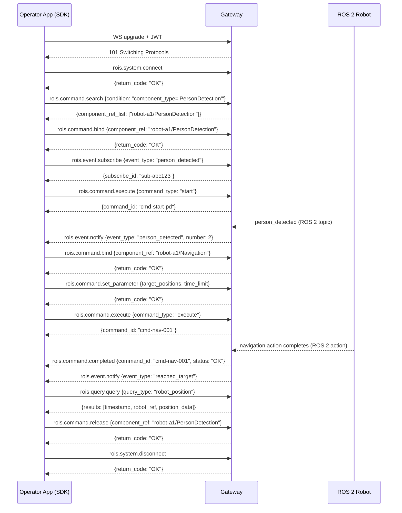

---

## 9. Deployment Topologies

The same four layers compose into different physical deployments. The client SDK and
gateway are constant. Only the BusAdapter and host layout change.

### 9.1 Topology A: Physical robot with web/Unity operator (primary)

The reference scenario: an operator application controls a ROS 2 robot over the
internet. The robot runs a sub-engine and component nodes. The Python gateway
bridges DDS to the remote client over WebSocket.

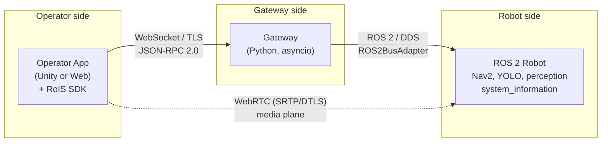

This is the primary demonstrated path and the MVP target (M5). From a clean checkout,
an operator can bring up the gateway and mock robot and control it from a browser or
Unity application.

### 9.2 Topology B: Mixed fleet (multiple adapters at once)

One gateway can host several adapters simultaneously. For example, a physical robot
(ROS 2) and a virtual concierge avatar (in-process) behind the same SDK endpoint.
This is the strongest proof the interfaces are paradigm-neutral.

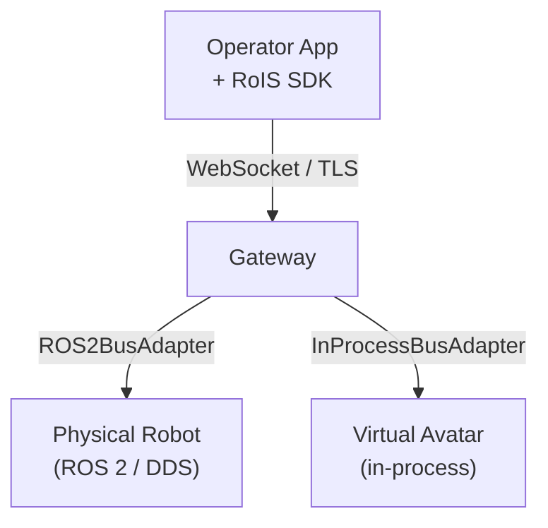

The mixed-paradigm test (M8) demonstrates that `search()` returns components from both
adapters, and the SDK controls each identically through one endpoint.

### 9.3 Topology C: Single-process avatar (secondary)

The simplest deployment: engine, gateway, and components live in one process (for
example, a Unity game, a Godot app, or a Node/browser runtime). No serialization, no
network bus.

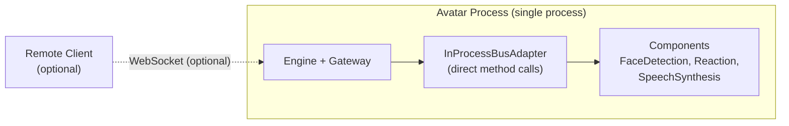

This topology is ideal for development and testing. It requires no external
dependencies and runs the full RoIS lifecycle in memory.

### 9.4 Topology D: Multi-process services (secondary)

A front-end plus separate AI services (perception, ASR/TTS) that may run on a GPU box
or in containers.

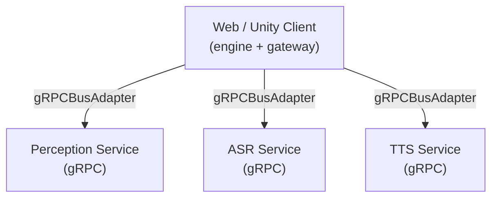

This topology suits deployments where perception or speech models run on dedicated
GPU hardware, accessed as gRPC services.

---

## 10. Transport Strategy

OpenRoIS deliberately separates messages from transport, so the right transport is
used at each boundary rather than forcing one everywhere.

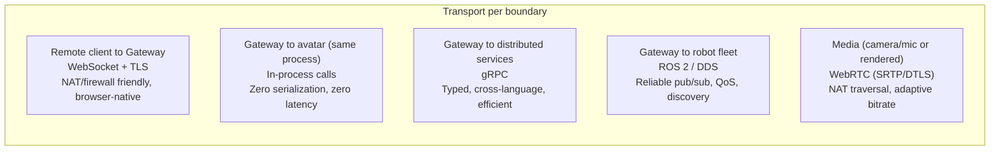

| Boundary | Transport | Rationale |
|----------|-----------|-----------|
| Remote client to Gateway | WebSocket + TLS | NAT/firewall friendly, browser-native, easy auth, async events. Matches the spec's Annex F.2.3 WebSocket example. |
| Gateway to avatar (same process) | In-process calls | Zero serialization and latency. Ideal for Unity, Godot, or Web hosts. |
| Gateway to distributed services | gRPC | Typed, cross-language, efficient. Good for GPU/AI services. |
| Gateway to robot fleet | ROS 2 / DDS | Reliable pub/sub, QoS, discovery, ecosystem (Nav2, perception). |
| Media (camera/mic or rendered) | WebRTC (SRTP/DTLS) | Built-in NAT traversal (ICE/STUN/TURN), adaptive bitrate, encrypted, browser-native. |

These are complementary, not competing. In-process, gRPC, and DDS each solve a
different host boundary. WebSocket solves the remote control boundary. WebRTC
solves real-time media. Each is selected by the active BusAdapter at Layer 3, except
WebSocket (always the remote edge) and WebRTC (always the media plane).

---

## 11. Control Plane vs. Data Plane

RoIS defines only the streaming **control plane**. The media **data plane** is out
of scope, which makes WebRTC a natural fit.

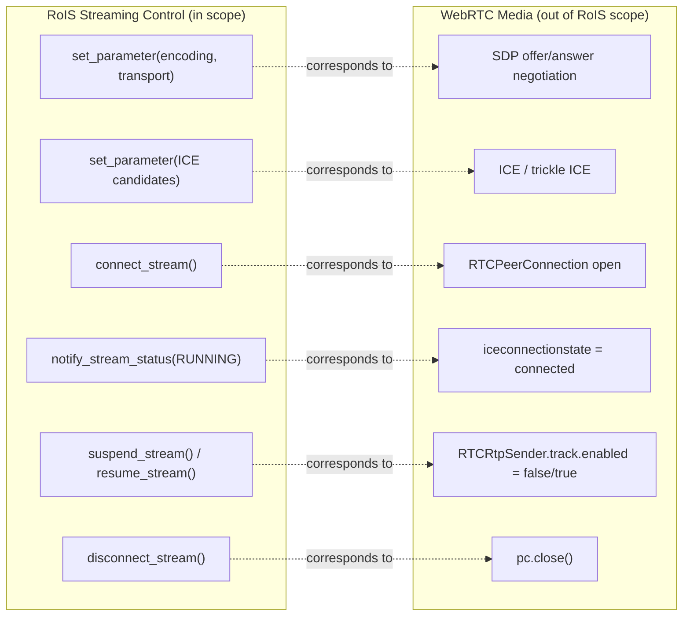

WebRTC signaling travels over the existing WebSocket RoIS connection (passed as
`set_parameter` arguments), so no separate signaling server is required.

An important distinction the specification preserves: Speech Synthesis is a
**command** component (text to robot speaker locally), not a stream. Audio and Video
Streaming are **stream-control** components (live media robot to operator), using
WebRTC.

### 11.1 P2P vs. SFU

- **Fleet of 1 to 3 robots**: peer-to-peer WebRTC is sufficient.
- **Larger fleets**: route media through a Selective Forwarding Unit (mediasoup,
  LiveKit). The RoIS streaming control interface is identical either way. The SFU is
  an implementation detail of the gateway.

---

## 12. Security Architecture

Security is phased but never bolted on. Auth hooks exist from M2 (the gateway
milestone). Full multi-tenant enforcement lands in M9.

### 12.1 Authentication flow

The specification's `connect()` takes no parameters (it assumes a trusted LAN). For
remote access, OpenRoIS authenticates before any RoIS message is processed, at the
WebSocket upgrade.

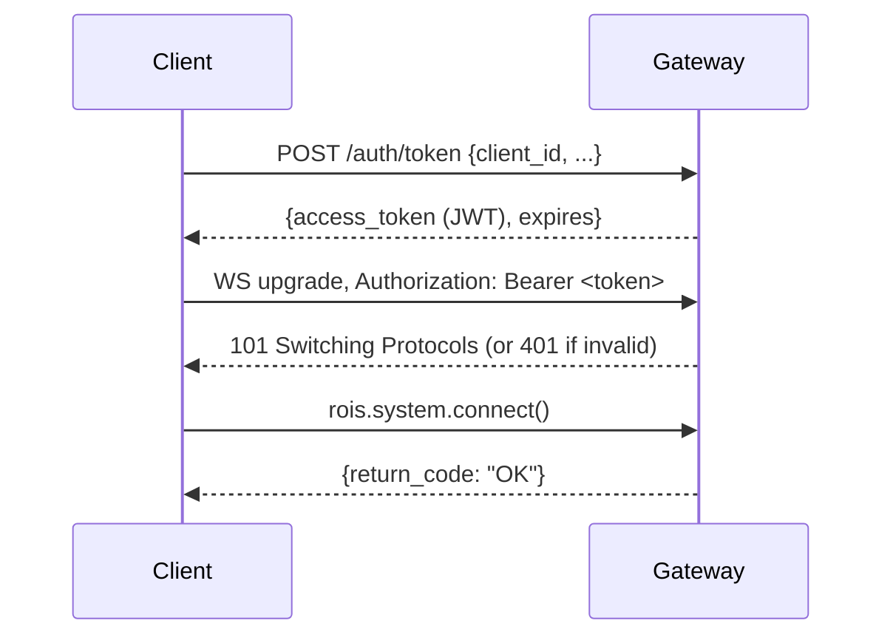

Example JWT claims used downstream for authorization:

```json
{
  "sub": "operator-alice",
  "roles": ["operator"],
  "fleet_scope": ["warehouse-north", "lab-b"],
  "components": ["person_detection", "navigation", "video_streaming"],
  "iat": 1749500000,
  "exp": 1749503600
}
```

### 12.2 Authorization model (RBAC)

Authorization is enforced per RoIS operation inside the gateway. The spec's
`Condition_t` (an ISO 19143 filter expression) and `component_ref` are the natural
enforcement points.

| Role | Fleet scope | Component scope |
|------|-------------|-----------------|
| admin | all | all |
| operator | assigned | assigned (including actuation) |
| viewer | assigned | detection + streaming only |
| maintenance | assigned | system_information |

### 12.3 Enforcement points

| Interface / operation | Enforcement |
|-----------------------|-------------|
| `connect()` | Verify JWT. Expose only sub-engines within `fleet_scope`. |
| `search(condition)` | Filter `component_ref_list` to authorized fleet and components. |
| `bind(component_ref)` | Reject refs outside scope. |
| `execute(command_unit_list)` | Validate every `component_ref` in the sequence. |
| `query(query_type, condition)` | Filter results to authorized fleets. |
| `subscribe(event_type, condition)` | Deliver `notify_event` only for authorized sources. |
| `connect_stream()` | Require streaming scope. SFU enforces per-stream ACL. |

Because the gateway filters at `search()`, robots outside a caller's scope are
invisible. The caller cannot discover or address them.

### 12.4 Defense in depth

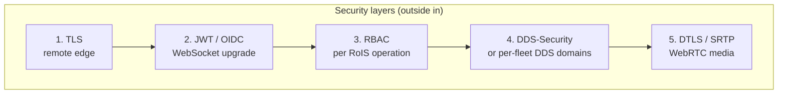

---

## 13. Component Library

RoIS defines 17 basic HRI components. Every component (except System Information)
shares the `RoIS_Common` interface: `start`, `stop`, `suspend`, `resume`, and
`component_status`. About 70% of components are identical across paradigms. The
perception and speech components run the same ML models whether the input is a robot
camera or a webcam. Only actuation, world model, and stream source differ.

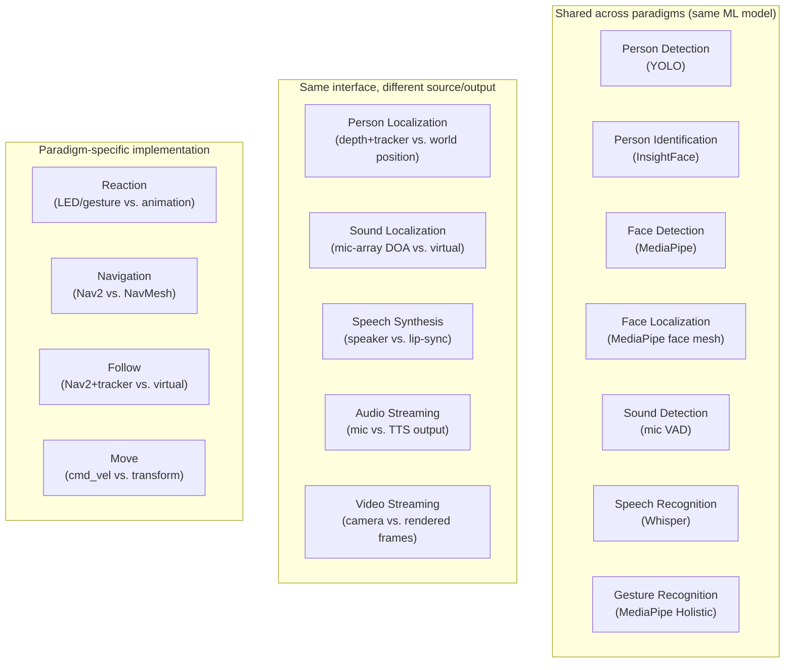

| Component | Robot backend | Avatar backend | Shared? |
|-----------|---------------|----------------|---------|
| Person Detection | YOLO on camera | YOLO on webcam | yes |
| Person Localization | depth + tracker | world position | diff coord system |
| Person Identification | InsightFace | InsightFace | yes |
| Face Detection | MediaPipe | MediaPipe | yes |
| Face Localization | MediaPipe face mesh | MediaPipe face mesh | yes |
| Sound Detection | mic VAD | mic VAD | yes |
| Sound Localization | mic-array DOA | mic-array DOA / virtual | diff |
| Speech Recognition | Whisper | Whisper | yes |
| Gesture Recognition | MediaPipe Holistic | MediaPipe Holistic | yes |
| Speech Synthesis | TTS to speaker | TTS to lip-sync | diff output |
| Reaction | LED / gesture | animation / expression | paradigm-specific |
| Navigation | Nav2 (physical) | NavMesh (virtual) | paradigm-specific |
| Follow | Nav2 + tracker | virtual follow | paradigm-specific |
| Move | `cmd_vel` to motors | transform to avatar | paradigm-specific |
| Audio Streaming | mic to WebRTC | TTS output to WebRTC | diff source |
| Video Streaming | camera to WebRTC | rendered frames to WebRTC | diff source |
| System Information | battery, CPU, joints | FPS, memory, avatar state | diff state |

The component's logic is the same across adapters. Only the binding differs. The
spec also supports user-defined components beyond the basic 17, reusing `RoIS_Common`
and the profile mechanism. An HRI Component Profile can include another profile via
`sub_component`, so an extended component can reuse a base component's messages and
add new ones.

---

## 14. Roadmap and Maturity

OpenRoIS is built in vertical slices. Each milestone delivers a working end-to-end
path, not an isolated layer.

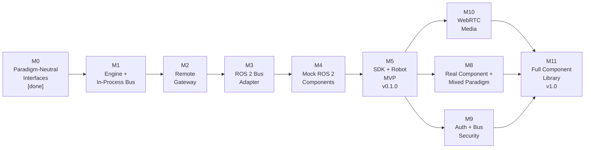

| Milestone | Theme | Output | Status |
|-----------|-------|--------|--------|
| M0 | Paradigm-Neutral Interfaces | `interfaces` (Pydantic to JSON Schema to C#/TS), `BusAdapter` contract | DONE |
| M1 | Engine and In-Process Bus | `engine`, `InProcessBusAdapter`, mock components | TODO |
| M2 | Remote Gateway | `gateway` (WebSocket, JSON-RPC 2.0, auth hook) | TODO |
| M3 | ROS 2 Bus Adapter | `ROS2BusAdapter` (rclpy), no core changes | TODO |
| M4 | Mock ROS 2 Robot Components | `person_detection`, `navigation`, `system_information` nodes | TODO |
| M5 | SDK and Robot MVP | `sdk-js`, web operator app, **v0.1.0 release** | TODO |
| M8 | Real Robot Component and Mixed Paradigm | YOLO `person_detection`, robot + avatar on one gateway | TODO |
| M9 | Auth and Bus Security | `auth`, `rbac`, per-fleet isolation | TODO |
| M10 | WebRTC Media | Streaming components, telepresence | TODO |
| M11 | Full Component Library | All 17 basic components, both paradigms, **v1.0** | TODO |

The MVP is M5: the minimum that lets an operator clone, build, and control a ROS 2
robot from a web application over WebSocket. The paradigm-neutrality proof is M8 (mixed
robot + avatar on one gateway). The 1.0 release is M11.

### 14.1 Versioning

- `v0.x`: unstable, breaking changes may occur without notice.
- `v1.0` (M11): first stable release with semantic versioning guarantees.

### 14.2 Current state

As of this writing, M0 is complete. The interface types are authored as Pydantic
models, exported to JSON Schema, and generated into C# and TypeScript. The
`BusAdapter` contract is defined and frozen for M1. Three of 17 basic components
(PersonDetection, Navigation, SystemInformation) have typed message models. The
remaining milestones are planned or under construction.

---

## 15. Related Work and Positioning

### 15.1 RoIS and other HRI standards

RoIS is not the only standard addressing human-robot interaction. However, it is
unique in defining a **platform-independent model** at the symbolic level, separate
from any transport. Other approaches tend to couple the interface to a specific
middleware (for example, ROS actions, gRPC services, or CORBA operations). RoIS
defines the messages and lets the implementation choose the transport, which is the
property OpenRoIS exploits through the `BusAdapter` contract.

### 15.2 OpenRoIS and ROS 2

ROS 2 is the dominant research robotics middleware and one of the spec's approved
transports. OpenRoIS does not compete with ROS 2. It uses ROS 2 as the primary robot
bus adapter (`ROS2BusAdapter`). RoIS operations map to ROS 2 primitives: synchronous
operations to services, long-running operations to actions, async push to topics.
The value OpenRoIS adds is a **standardized symbolic interface** above ROS 2, so
that the same operator application can also drive a virtual avatar or a distributed
service without rewriting the scenario logic.

### 15.3 OpenRoIS and Unity

Unity is a secondary client platform for operator applications. The C# SDK targets
Unity via UPM and runs on both Mono (Unity 6.3+) and CoreCLR (Unity 6.8). The same
SDK also works outside Unity (any .NET runtime). The in-process avatar topology
means a Unity application can host the engine, gateway, and avatar components in a
single process, with zero serialization overhead.

### 15.4 Conformance

An implementation claiming RoIS conformance shall:

- Provide the interfaces described in the RoIS specification section 8.2.
- Support the message data structures described in section 8.3 (RoIS Profiles).
- Support the Common Messages of section 8.4 for the basic components it implements
  (it need not implement every basic component).
- Handle component profiles described as XML files and the messages defined therein.

OpenRoIS targets full conformance. The interface types are cross-checked against the
normative XML profiles and validated against `XML-Profiles.xsd` in CI. A conformance
test suite asserts behavior against the spec's interfaces and profiles, run against
every BusAdapter.

---

## 16. Conclusion

OpenRoIS demonstrates that the OMG RoIS Framework 2.0 can be implemented as a
practical, paradigm-neutral middleware with clean developer experience. The key
insight is that the spec's separation of message from transport enables a single
`BusAdapter` contract to decouple the engine from ROS 2, in-process runtimes, gRPC
services, and any future paradigm. Adding a new paradigm is an additive adapter,
never a rewrite.

The single-source-of-truth type pipeline (Python Pydantic to JSON Schema to C# and
TypeScript) keeps three language stacks consistent without manual synchronization.
The JSON-RPC 2.0 wire protocol over WebSocket provides a browser-native, NAT-friendly
control plane with full async event support. The three SDKs (C# for Unity,
TypeScript for web, Python for scripting) expose identical behavior regardless of the
host paradigm behind the gateway.

The project is in alpha. The interfaces layer is complete. The engine, gateway, bus
adapters, components, and SDKs are under construction. Researchers and engineers
evaluating RoIS 2.0 can use OpenRoIS as a reference implementation, contribute
reference components, or build applications against the SDK today.

### 16.1 Getting involved

- **Repository**: [github.com/openrois/openrois](https://github.com/openrois/openrois)
- **License**: Apache-2.0
- **Specification**: [OMG RoIS Framework 2.0](https://www.omg.org/spec/RoIS/2.0/Beta2)
- **Roadmap**: [roadmap.md](roadmap.md)
- **Architecture**: [architecture.md](architecture.md)
- **Specification reference**: [rois-reference.md](rois-reference.md)

Contributions are welcome. The milestone roadmap defines clear, parallelizable work
items. Reference components are the natural entry point for new contributors.

---

*OpenRoIS is an open-source middleware for the OMG RoIS Framework 2.0. Control
robots, avatars, and digital agents from one paradigm-neutral SDK. Apache-2.0.
Alpha, pre-1.0, unstable API.*
